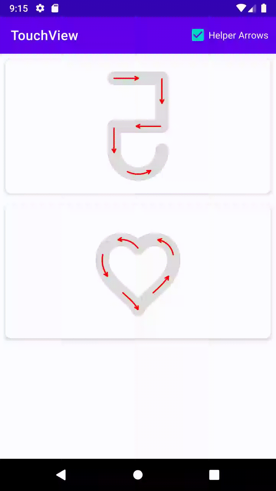
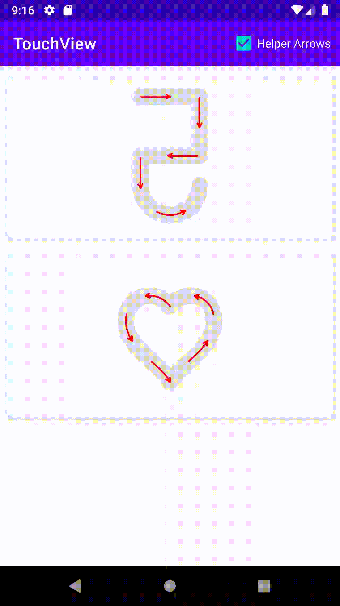

# TouchView
 A simple view for android, working with Path

  

## Sample

```java
AXTouchView touchView = findViewById(R.id.touch);
touchView.setHelperArrowsEnabled(true);
touchView.setPath(path);
touchView.animate(1000, 500, null);

TextView tv = findViewById(R.id.tv);
touchView.setOnTouchViewListener(new AXTouchView.OnTouchViewListener() {
    @Override
    public void onProgressChanged(AXTouchView touchView, float progress) {
        if (progress >= 1)
            Toast.makeText(PathActivity.this, "DONE!", Toast.LENGTH_SHORT).show();
        tv.setText(MessageFormat.format("Progress: {0}%", (int) (progress * 100)));
    }

    @Override
    public void onStartTrackingTouch(AXTouchView touchView) {
    }

    @Override
    public void onStopTrackingTouch(AXTouchView touchView) {
    }
});
```
